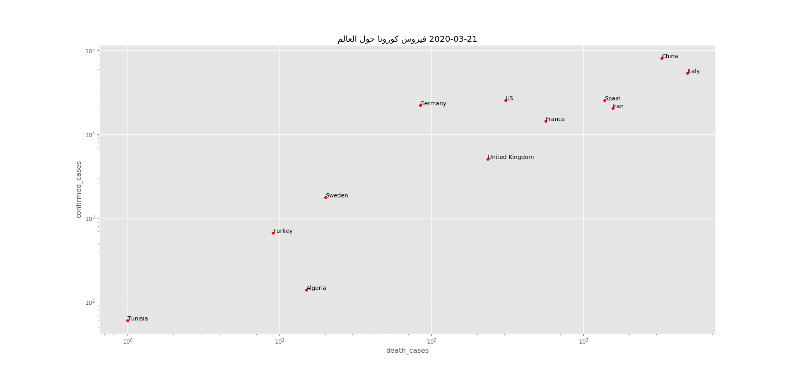

</img>

# COVID-19-study
- A study of COVID-19 in Tunisia and Germany (scripts can be used for other countries.)
- The project a couple of scripts that helps scrape the COVID-19 cases, provided by  Johns Hopkins University (JHU CSSE).
- The scraped data can be manipulated and interesting visualization can be drawn describing the current state of the spread.
- The Data is fitted to a Logarithmic curve and a SIR model.

# Requirements
use `pip install -r requirements.txt` to install the project dependencies.

# Examples
A couple of examples are also available under the form of Jupyter-notebooks that provide a couple of visualizations of the situation:
- In the world
- In Tunisia
- In Germany

# Graphs
- Arabic labeled curves: Tunisia
- English labeled curves: Germany

# Sources and References
- [github/CSSEGISandData/COVID-19](https://github.com/CSSEGISandData/COVID-19)
- [Estimating The Infected Population From Deaths](https://covid19dashboards.com/covid-infected/)
- [COVID-19 Growth By State (US)](https://covid19dashboards.com/growth-us-states/)
- [COVID-19 Growth Rate Prediction](https://covid19dashboards.com/growth-bayes/)
- [github/covid19-dashboard ](https://github.com/github/covid19-dashboard)
- [Estimating actual COVID 19 cases (novel corona virus infections) in an area based on deaths](https://www.youtube.com/watch?v=mCa0JXEwDEk)
- [Exponential growth and epidemics](https://www.youtube.com/watch?v=Kas0tIxDvrg&t=361s)
- [فيروس كورونا: لماذا يجب عليك التصرف الآن؟](https://chefrour.blogspot.com/2020/03/blog-post_71.html)
- [The Mathematics Behind the Ebola Epidemic](http://corysimon.github.io/articles/the-mathematics-behind-the-ebola-epidemic/)
- [The SIR epidemic model](https://scipython.com/book/chapter-8-scipy/additional-examples/the-sir-epidemic-model/)
